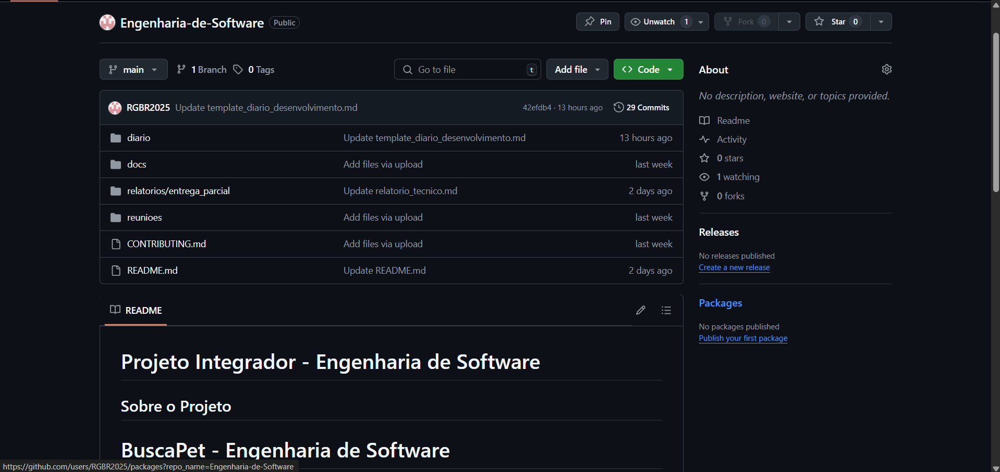

# Diário de Desenvolvimento

## Diário de Desenvolvimento - Projeto Integrador de Engenharia de Software

**Grupo:** BuscaPet

**Integrantes:** Bruno Miguel Oliveira, Guilherme Matos, Richard de Lima, Rian Arrotheia, Pedro Henrique Costa, Lucas Henrique Oliveira

---

## Semana 15

### Informações Básicas

**Data:** 13/05/2025
**Membros presentes:** Bruno Miguel Oliveira, Guilherme Matos, Richard de Lima, Rian Arrotheia, Pedro Henrique Costa, Lucas Henrique Oliveira
**Tema da semana:** Organização do projeto no GitHub

### Atividades Realizadas

**Descrição das atividades:**

- Estruturar corretamente o repositório no GitHub, através dos templates disponibilizados.

**Artefatos produzidos:**

- Reposítorio estruturado e organizado - (https://github.com/RGBR2025/Engenharia-de-Software/tree/main)

**Distribuição de tarefas:**

- Bruno Miguel Oliveira: escrever e estruturar os documentos
- Guilherme Matos: auxílio na estruturação
- Richard de Lima: auxílio na estruturação
- Rian Arrotheia: auxílio na estruturação
- Pedro Henrique Costa: auxílio na estruturação
- Lucas Henrique Oliveira: auxílio na estruturação

### Dificuldades e Soluções

**Desafios encontrados:**

- Baixo nível de conhecimento na plataforma (GitHub), com isso enfrentamos alguns problemas em como utilizá-la.

**Soluções adotadas:**

- Para o baixo conhecimento na plataforma: pesquisamos sobre e estudamos um pouco sobre git e a plataforma GitHub.

**Conhecimentos adquiridos:**

- Adquirimos um conhecimento básico e essencial para manusear a plataforma, e evoluir em nosso projeto.

### Reflexão sobre Aplicação dos Conceitos

**Conceitos teóricos aplicados:**

- Estruturação do repositório: através dos templates disponibilizados, estruturamos nosso repositório e o deixamos organizado.
- Plataforma GitHub: através de pesquisas/estudos e orientação do professor, aprendemos a utilizar a plataforma.

**Insights obtidos:**

- A enorme importância de um bom repositório e o versionamento de código.

**Conexões com conteúdos anteriores:**

- A importância da engenharia de software em projetos. Ter um bom repositório é fundamental. 

### Próximos Passos

**Planejamento para próxima aula:**

- Prototipação de telas.
- Layout geral da plataforma (BuscaPet).

**Tarefas pendentes:**

- Nenhuma: todas planejadas, concluidas e feitas no cronograma estabelecido.

**Objetivos para próxima semana:**

- Construir um layout que atenda as histórias de usuários.
- Realizar protótipos de telas/layout do nosso sistema.

### Registros Visuais

