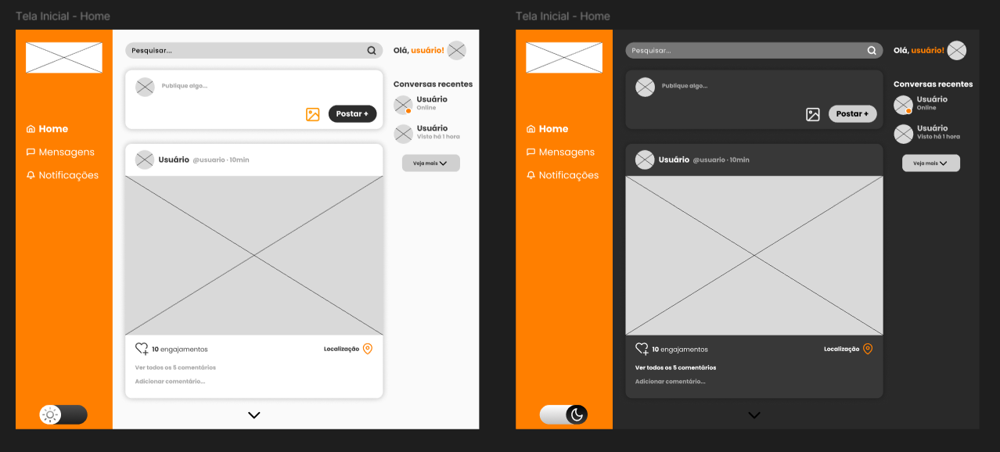

# Diário de Desenvolvimento

## Diário de Desenvolvimento - Projeto Integrador de Engenharia de Software

**Grupo:** BuscaPet

**Integrantes:** Bruno Miguel Oliveira, Guilherme Matos, Richard de Lima, Rian Arrotheia, Pedro Henrique Costa, Lucas Henrique Oliveira

---

## Semana 16

### Informações Básicas

**Data:** 20/05/2025
**Membros presentes:** Bruno Miguel Oliveira, Guilherme Matos, Richard de Lima, Rian Arrotheia, Pedro Henrique Costa, Lucas Henrique Oliveira
**Tema da semana:** Prototipação e Design de Interface

### Atividades Realizadas

**Descrição das atividades:**

- Desenvolver protótipos de interface e escolher a que melhor atende os requisitos, e receba uma excelente feedback.

**Artefatos produzidos:**

- Guia de Estilo - (https://github.com/RGBR2025/Engenharia-de-Software/blob/main/docs/BuscaPet_Guia_de_Estilo_B%C3%A1sico.pdf)

**Distribuição de tarefas:**

- Bruno Miguel Oliveira: criar interfaces
- Guilherme Matos: criar interfaces
- Richard de Lima: auxílio na construção das interfaces
- Rian Arrotheia: testar interface criada
- Pedro Henrique Costa: testar interface criada
- Lucas Henrique Oliveira: auxílio na construção das interfaces

### Dificuldades e Soluções

**Desafios encontrados:**

- No desenvolvimento, não houve desafios, chegamos onde queriamos sem grandes dificuldades.

**Soluções adotadas:**

- Nenhuma, não houve desafios.

**Conhecimentos adquiridos:**

- Um bom layout não é aquele cheio de informações, e sim aquele funcional, simples, porém atrativo. 

### Reflexão sobre Aplicação dos Conceitos

**Conceitos teóricos aplicados:**

- Conhecimentos da matéria de Design e UX: conseguimos construir as interfaces sem grandes dificuldades, graças ao conhecimento de Design e UX. Aplicamos conceitos como teoria das cores, tipografia, a Lei de Jakob etc.

**Insights obtidos:**

- Um bom layout(interface), ajuda na navegação, otimiza tempo e é excelente para a atratividade do sistema(website).

**Conexões com conteúdos anteriores:**

- Nos baseamos nos conhecimentos adquiridos em outra matéria do curso, Design e UX, nele aprendemos diversas noções de design e aplicamos na construção do layout.

### Próximos Passos

**Planejamento para próxima aula:**

- Iniciar o desenvolvimento do sistema.

**Tarefas pendentes:**

- Nenhuma: todas planejadas, concluidas e feitas no cronograma estabelecido.

**Objetivos para próxima semana:**

- Iniciar a construção do sistema nas linguagens escolhidas, atendendo os requisitos e interface escolhida, e se possível, já deixá-lo funcional.

### Registros Visuais

